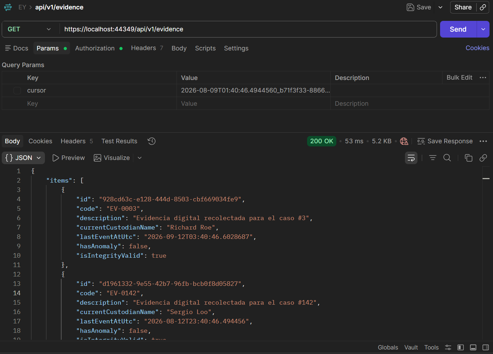
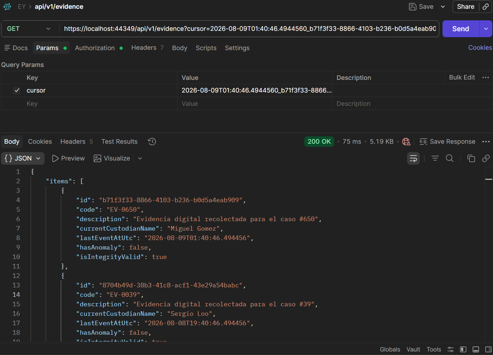
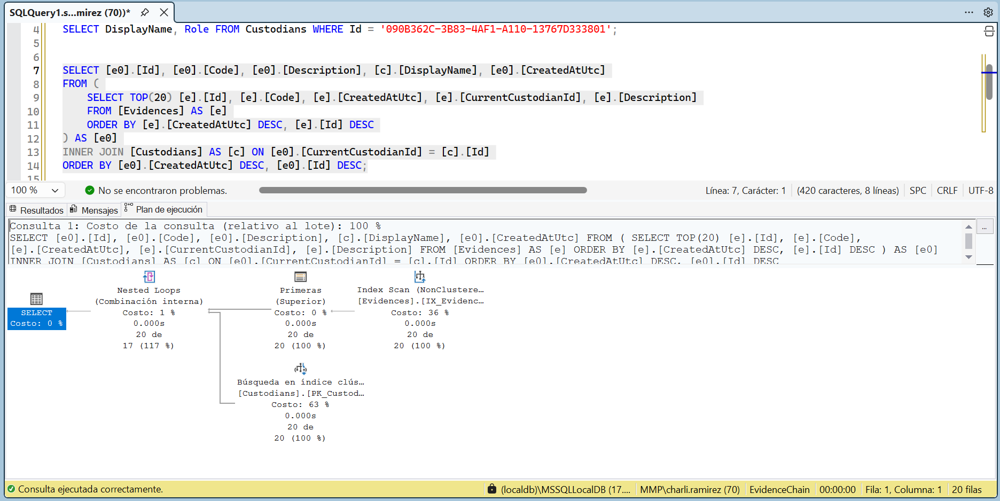
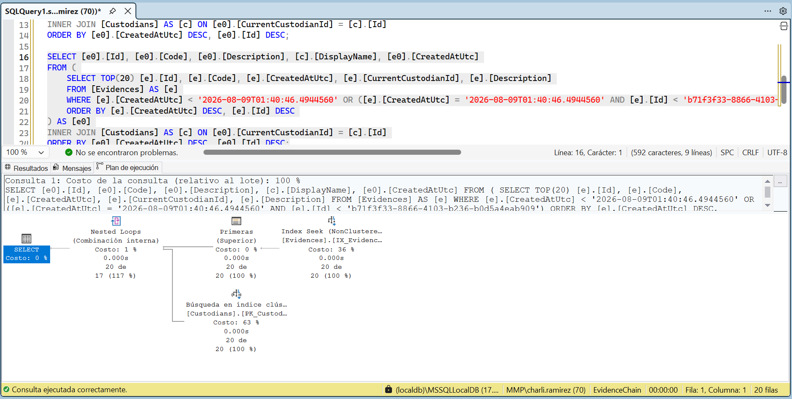

# overview.md

## Qué terminé

- Modelo de dominio completo: `Custodian`, `Evidence`, `CustodyEvent` (append-only, encadenado por hash), `CustodyTransfer` (con máquina de estados y `RowVersion`).
- Hash chain con formato canónico documentado en `decisions.md`, y `GET /evidence/{id}/chain/verify` que detecta el primer evento manipulado.
- Bandeja de evidencias con filtros (texto, custodio), orden asc/desc, paginación keyset, y estado de integridad calculado por página.
- Detalle de evidencia con línea de tiempo y regla de anomalía (transferencia vencida, con severidad escalonada según cuánto se excedió el plazo).
- Flujo completo de transferencia de custodia: creación (con `Idempotency-Key`), aceptación/rechazo (con `If-Match` y concurrencia optimista, `409` en `application/problem+json`), restringido a los roles correspondientes (Investigador crea, solo el Custodio destinatario resuelve).
- Autenticación JWT simplificada con `LoginCode` legible por rol (Investigador / Custodio / Supervisor); lectura abierta a cualquier rol autenticado, escritura restringida.
- Seed reproducible (semilla fija): 1,000 evidencias, ~10,000 eventos, con los 3 casos obligatorios (cadena íntegra, evento alterado, transferencia vencida).
- Frontend en React: login, bandeja con filtros persistidos en la URL, detalle con verificación de cadena, modal de transferencia con optimistic UI y accesibilidad (foco atrapado, Escape, retorno de foco), vista de transferencias pendientes para el rol Custodio.
- Tests automatizados de backend: cadena alterada, idempotencia, conflicto de concurrencia, transición inválida (`backend/EvidenceChain.Tests/`).
- `docs/ai-code-review.md`, `docs/ai-usage.md`, `docs/decisions.md`, `docs/code-map.md`.

## Qué dejé fuera del alcance obligatorio

- Extras opcionales del enunciado: subida de archivos, rate limiting, i18n, segunda regla de anomalía, despliegue real en Azure con IaC.
- Paginación "anterior" en la bandeja: la UI actual solo avanza; retroceder es viable del lado del cliente manteniendo una pila de cursores ya visitados, sin cambios en el backend, pero no llegué a implementarlo.
- Verificar y, de ser necesario, completar los tests de frontend (búsqueda obsoleta, rollback ante 409) antes de la entrega final — confirmar su estado real contra el repositorio.

## Cómo levantar el proyecto, ejecutar el seed y las pruebas

```bash
# Database (LocalDB en desarrollo)
sqllocaldb start MSSQLLocalDB

# Backend:
cp backend/EvidenceChain.Api/appsettings.Example.json backend/EvidenceChain.Api/appsettings.Development.json
dotnet ef database update --project backend/EvidenceChain.Infrastructure --startup-project backend/EvidenceChain.Api

# Seed reproducible
dotnet run --project database/EvidenceChain.Seed

# Backend
dotnet run --project backend/EvidenceChain.Api

# Frontend
cd frontend
npm install
npm run dev

# Tests de backend
dotnet test backend/EvidenceChain.slnx
```

La API expone Swagger en `/swagger` para probar los endpoints con el botón "Authorize" (pegar `Bearer <token>` obtenido de `POST /api/v1/auth/login`).

## Cómo medí la consulta principal

Para la consulta principal se midió el tiempo de respuesta de extremo a extremo desde Postman, ejecutando `GET /api/v1/evidence` contra la base con las 1,000 evidencias del seed — el tiempo mostrado por Postman confirma que la consulta responde rápido incluso con el volumen completo de datos.
sin filtros/paginación:

con paginación:


Como segunda verificación, se midió con el plan de ejecución real en SSMS (`Include Actual Execution Plan`), usando el SQL exacto generado por EF Core (visible en los logs de la consola al correr la API).
sin filtros/paginación:

con paginación:

